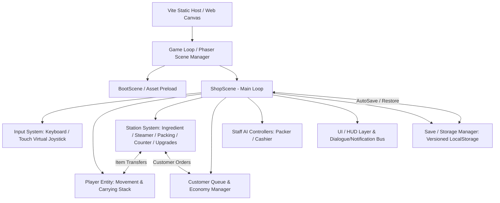

# Modak Mahal: Festival Rush — System Architecture

## 1. System Architecture
Modak Mahal is built as a client-side, single-page progressive web game using Phaser 3, TypeScript, and Vite. There is no external backend dependency or live server requirement; all simulation, state management, entity logic, and progress persistence execute deterministically in the client browser.



## 2. Frontend
- **Rendering Engine**: Phaser 3 (`Phaser.AUTO`, WebGL with Canvas fallback).
- **Resolution & Scaling**: Fixed game world coordinate space (e.g. 960x540 or 1280x720) rendered with `Phaser.Scale.FIT` and `Phaser.Scale.CENTER_BOTH` to ensure optimal presentation on desktop monitors, tablets, and mobile phones.
- **Visual Presentation**:
  - Warm Indian festive palette (marigold orange, saffron, turmeric yellow, deep vermilion, brass, and terracotta).
  - Overhead 2.5D perspective with visible depth sorting (`depth = y`).
  - Tactile physical stacking above player and stations.
  - Floating coin feedback, particle puffs for cooking, and emote bubbles for customers.
- **Controls**:
  - Desktop: WASD / Arrow keys for 8-directional movement.
  - Mobile: Dynamic on-screen touch joystick rendered in lower screen quadrant; touch anywhere inside radius.
  - Interaction: Automatic proximity-based interaction zones with visual circle progress indicators when standing within range.

## 3. Backend
- None required for MVP and core contest submission. The game is fully self-contained as a static web bundle suitable for GitHub Pages, Vercel, Netlify, or static CDN hosting.

## 4. Database & Storage
- **Client Storage**: Browser `window.localStorage`.
- **Data Schema**:
  ```typescript
  interface SaveStateV1 {
    version: 1;
    timestamp: number;
    coins: number;
    stats: {
      totalBoxesSold: number;
      totalRevenue: number;
      pandalCompleted: boolean;
      timeElapsedSeconds: number;
    };
    unlockedUpgrades: string[];
    inventories: {
      ingredients: number;
      steamers: Array<{ state: 'idle' | 'steaming' | 'ready'; progress: number; outputCount: number }>;
      packingInputBatches: number;
      packedBoxesStock: number;
      counterBoxesStock: number;
    };
  }
  ```
- **Storage Safety**: Atomic JSON write with schema validation and fallback on corruption or disabled cookies/private browsing.

## 5. APIs
- **Web Audio API**: Low-latency synthesized and procedural audio cues via Phaser's SoundManager.
- **DOM / Fullscreen API**: Toggleable fullscreen mode and responsive resize listeners.

## 6. Authentication
- None required. Cross-campus open play without logins, passwords, or campus-specific intranet barriers.

## 7. AI Components
- **Staff Helper Behavior**:
  - *Packer NPC*: Stationed at packing table. Automatically draws batches from packing input when available, executes the 3-second packaging loop, and deposits boxes into output tray.
  - *Cashier NPC*: Stationed at counter. Detects queuing customer requests and fulfills orders directly from the counter shelf stock without requiring player manual handover.
- **Customer Spawning & Queuing AI**:
  - Predictable waypoints from street entrance to ordering positions.
  - Patience decay timer (shows visual patience bar; tip bonus for quick service; leaves politely if timer expires).

## 8. Data Flow
1. **Purchase Action**: Player steps into Ingredient Shelf ring -> Spends 12 coins -> +1 Recipe Bundle added to Ingredient Shelf.
2. **Pickup & Load**: Player steps into Ingredient Shelf -> Picks up bundle (stacked on head) -> Walks to Steamer -> Deposition transfer -> Steamer switches to `Cooking` state (8s timer).
3. **Cooked Output**: Cook timer finishes -> Steamer state switches to `Ready` (1 Cooked Batch = 3 Modaks).
4. **Packing**: Player collects cooked batch -> Transports to Packing Station -> 3s packing process -> Yields 3 Modak Boxes.
5. **Customer Fulfillment**: Player carries Modak Boxes to Counter -> Steps into Counter ring -> Delivers requested boxes to front customer in queue -> Customer leaves -> Player awarded 10 coins per box + tips.

## 9. Folder Structure
```
d:/Projects/Ekara/
├── index.html
├── package.json
├── tsconfig.json
├── vite.config.ts
├── src/
│   ├── main.ts                   # Phaser game bootstrap
│   ├── config/
│   │   ├── balance.ts            # Economy, prices, timers, balance values
│   │   └── constants.ts          # Game dimensions, keys, depths
│   ├── types/
│   │   └── index.ts              # TypeScript models, states, item types
│   ├── state/
│   │   ├── GameState.ts          # Central state & inventory manager
│   │   └── SaveManager.ts        # LocalStorage persistence & migration
│   ├── entities/
│   │   ├── Player.ts             # Shopkeeper entity, movement, stack render
│   │   ├── Customer.ts           # Customer entity, queue pathing, patience
│   │   └── Staff.ts              # Packer & Cashier NPC logic
│   ├── stations/
│   │   ├── BaseStation.ts        # Common proximity ring & interaction logic
│   │   ├── IngredientStation.ts  # Shelf purchase & bundle pickup
│   │   ├── SteamerStation.ts     # Steaming machine & timer
│   │   ├── PackingStation.ts     # Packaging table
│   │   ├── CounterStation.ts     # Customer service counter
│   │   └── UpgradeStation.ts     # Equipment & staffing unlock kiosk
│   ├── systems/
│   │   ├── CustomerManager.ts    # Queue management, spawning, orders
│   │   ├── InputManager.ts       # WASD / arrows / touch virtual joystick
│   │   └── AudioManager.ts       # Sound FX triggers & volume/mute controls
│   ├── scenes/
│   │   ├── BootScene.ts          # Asset loading, procedural asset generation
│   │   ├── ShopScene.ts          # Main overhead gameplay scene
│   │   └── UIScene.ts            # HUD overlay (coins, objective, timer, dialogue)
│   └── tests/
│       ├── economy.test.ts       # Test inventory conservation & math
│       └── state.test.ts         # Test save/load and state transitions
```

## 10. Deployment
- Built with `vite build` into a self-contained `/dist` folder.
- Deployable to GitHub Pages, Netlify, or Vercel static hosting.
- Clean zero-configuration deployment with asset hash versioning for cache busting.

## 11. Security
- Client-side static architecture; zero SQL injection or server-side attack surface.
- Strict input clamping and validation on LocalStorage deserialization to prevent prototype pollution or infinite balance exploits.
- Content policy adheres to family-friendly, culturally respectful contest guidelines.

## 12. Important Technical Decisions
1. **Procedural Vector/Canvas Asset Pipeline with Sprite Generation**: Avoid broken asset 404s or third-party copyright issues by programmatically generating crisp, vibrant festival sprites (marigold garlands, traditional brass steamers, earthen pots, modak boxes, and characters) directly via Phaser canvas textures and SVG paths, with support for external sprite sheets.
2. **State Decoupled from Animation**: State logic (inventories, money, timers) is pure and decoupled from visual tweens and particles. If rendering drops frames, the simulation logic remains deterministic and accurate.
3. **No Overlapping Interaction Zones**: Station trigger radii are strictly spaced and collision-padded to avoid ambiguity when the player walks through busy lanes.
4. **Touch Input Resilience**: Virtual thumbstick automatically centers on first touch in lower screen area with touch-cancel and window-blur safeguards.
